# mp_flutter_chart

flutter charts just like [**MPAndroidChart**](https://github.com/PhilJay/MPAndroidChart)

Thanks for [**MPAndroidChart**](https://github.com/PhilJay/MPAndroidChart), when translate this library to flutter I learned a lot about matrix use in animation.

## todos
**1.In the design of flutter, the change of the widget can only be refreshed by its parent widget, so the parent widget needs to save all the data of its child widget. Now Chart saves the data by itself, so Chart is single instance in the example. It doesn't feel like any of the other flutter widgets, so I need to learn the design model of flutter, and then save the data needed for the Chart into another class(maybe a controller).When we use Chart, let the parent widget of the Chart hold that class's(controller's) instance, which may be better to use**
  
**2.potential bugs fix**

## More Examples
**LineCharts**

    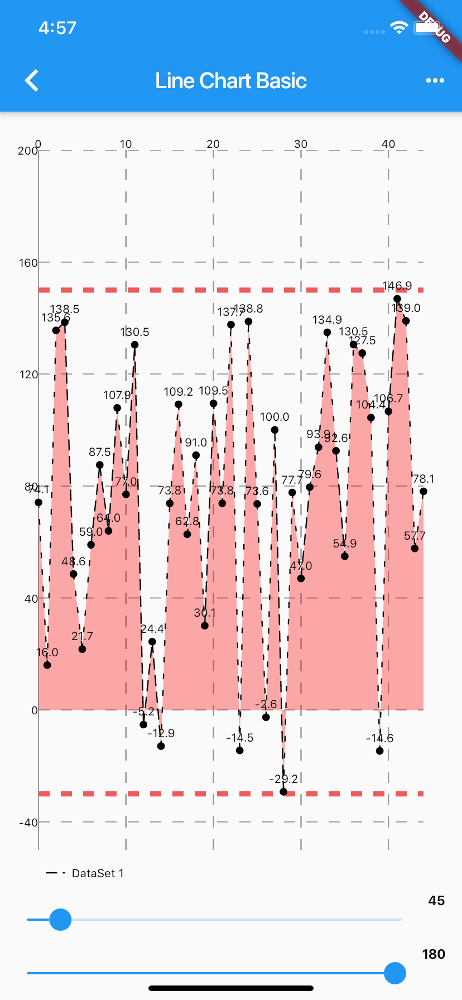

  

    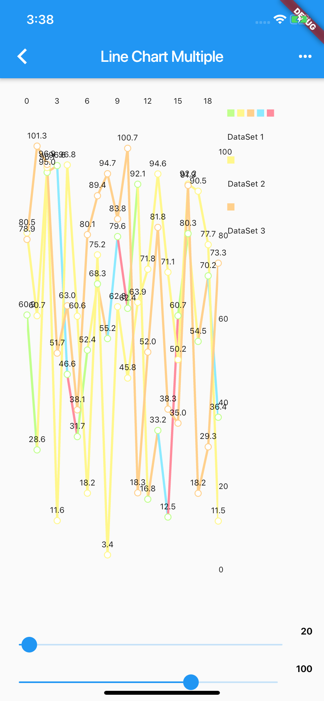

  

    

  

    

  

    

  

    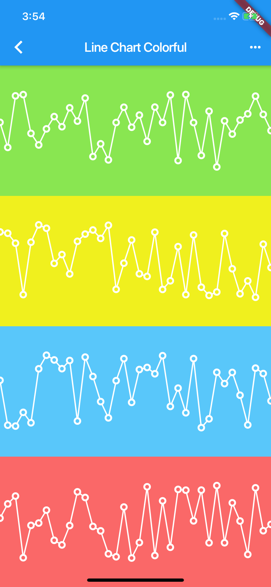

  

    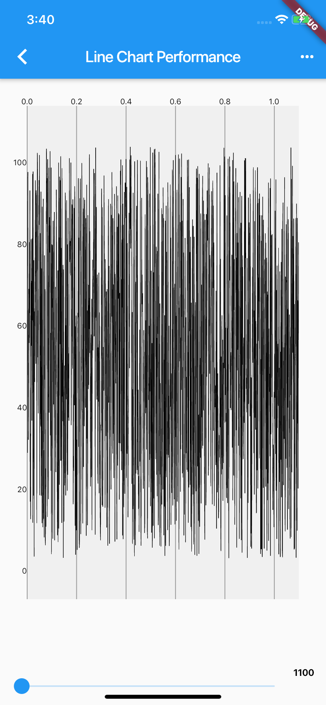

  

    

  

**BarCharts**

    

  

    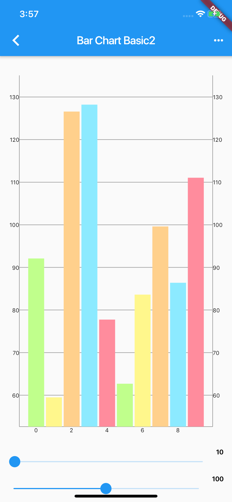

  

    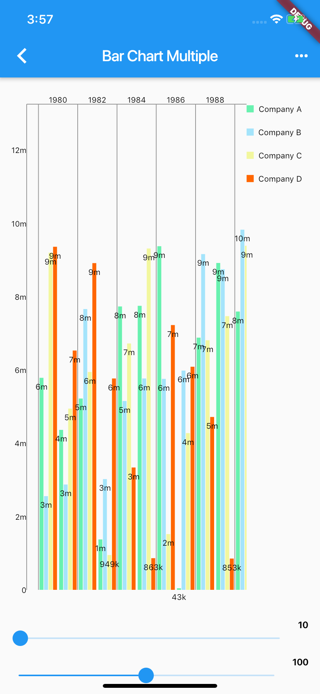

  

    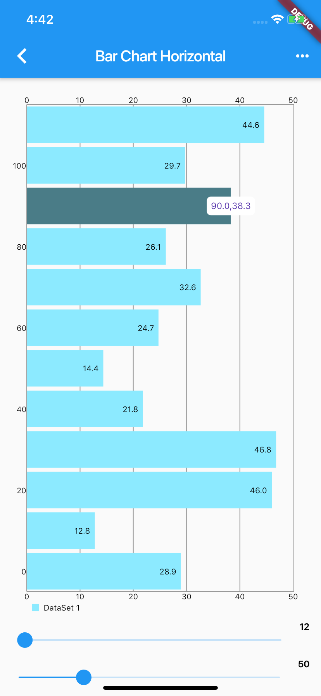

  

    

  

    

  

    

  

    

  

**PieCharts**

    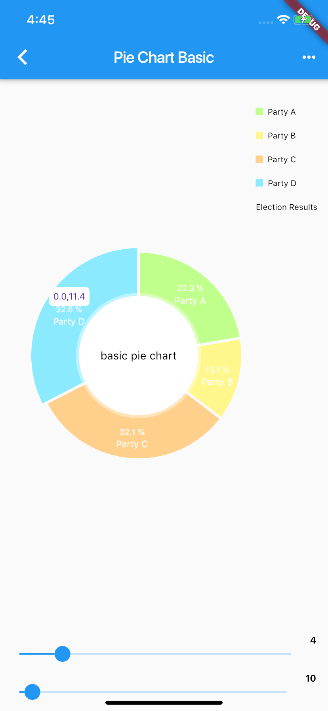

  

    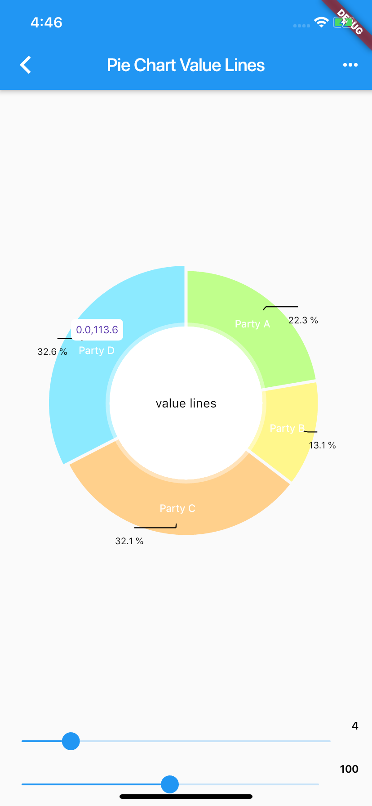

  

    

  

**OtherCharts**

    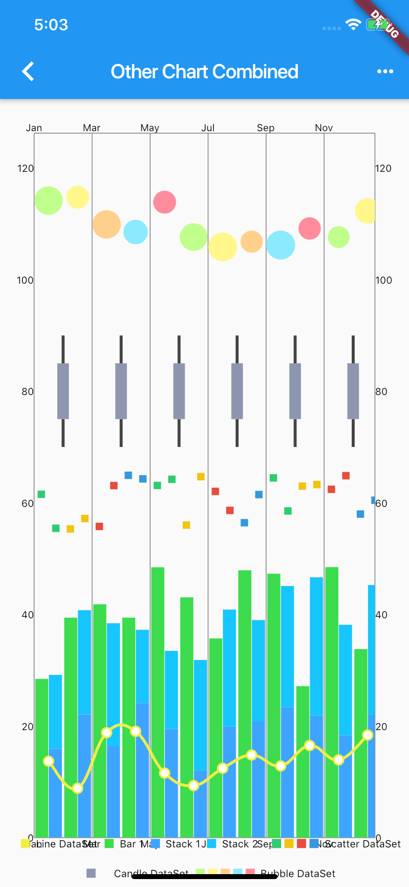

  

    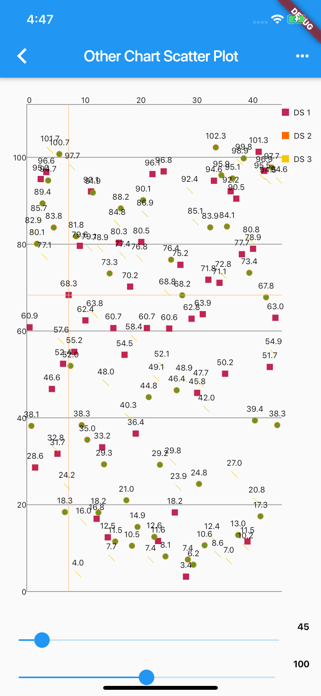

  

    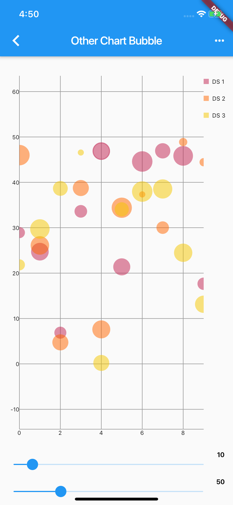

  

    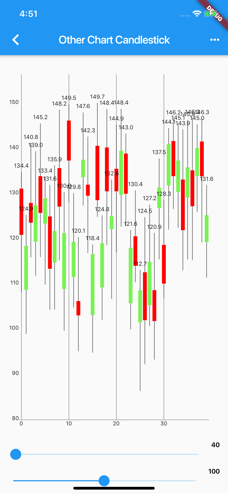

  

    

  

**ScrollingCharts**

    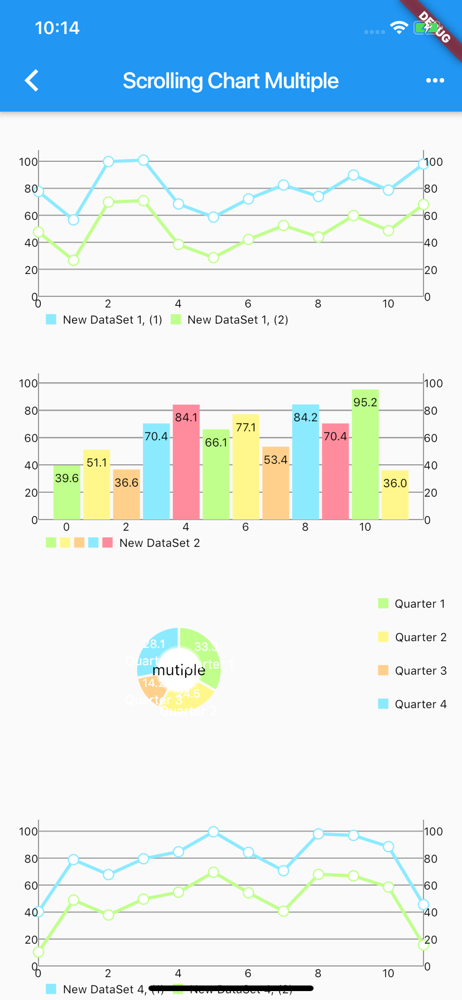

  

    

  

    

  

    

  

**EvenMoreCharts**

    

  

    

  

    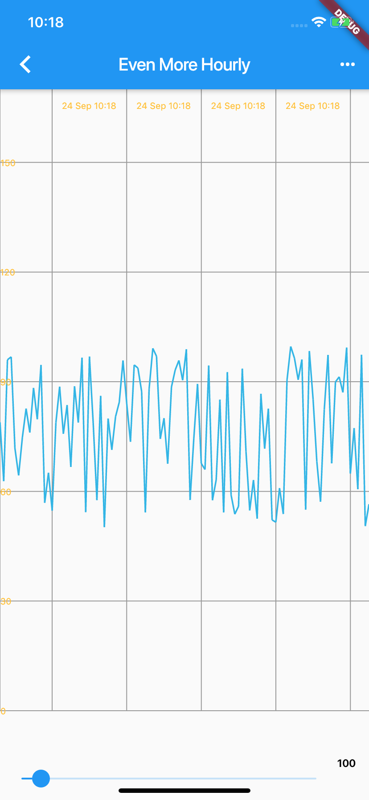

  